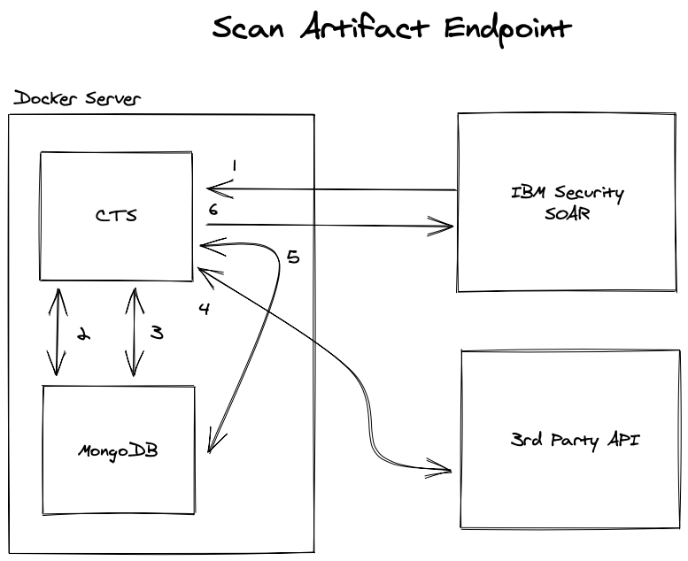
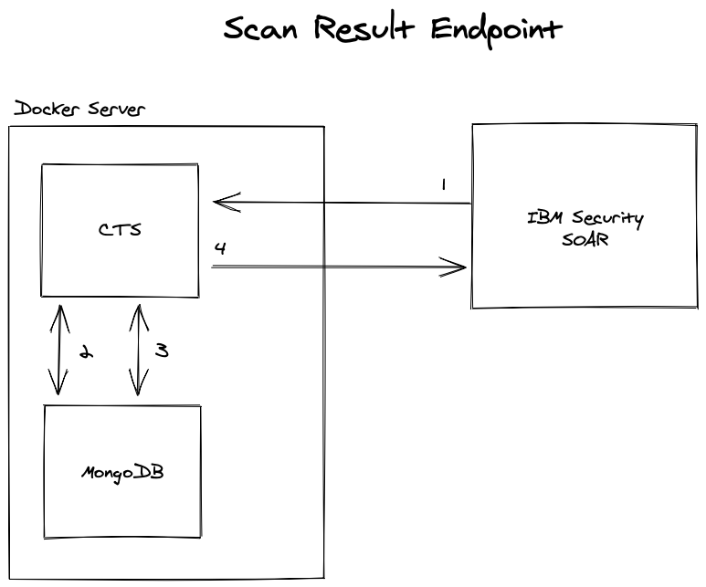

# resilient_async_cts

A library to create and run custom threat services (CTS) for IBM Security SOAR.

[Requirements](#requirements)

[How It Works](#how-it-works)

[How To Develop](#how-to-develop)

[How To Deploy](#how-to-deploy)

## Requirements

1. A MongoDB database that the CTS can connect to
    * TODO: see here for an easy to run docker container
2. A server that has Docker installed
3. A development environment with a version of Python greater than 3.6

## How it Works

This library was created with [asyncio](https://docs.python.org/3/library/asyncio.html). Asynchronous execution is great for code that is doing HTTP requests as it is non-blocking, allowing the CTS to handle many concurrent searches at the same time.

The CTS that is generated will contain three API endpoints. These endpoints are outlined in [this guide](https://github.com/ibmresilient/resilient-reference/blob/master/developer_guides/Resilient%20Systems%20Custom%20Threat%20Service%20Guide.pdf). Many of the terms specific to IBM Security SOAR CTSes used in this README are outlined in that guide, I  reccommend reading it before continuing. Each of the endpoints and what they do are briefly described below.

### Scan Artifact Endpoint

When an artifact is added to an IBM Security SOAR incident the platform will send a request containing information about the artifact to this endpoint.



**note:** the actual CTS deployment should probably have some kind of reverse proxy in front of the CTS.

1. IBM Security SOAR sends the CTS a request containing a `ThreatServiceArtifactDTO`. The CTS checks to make sure the artifact type is supported before advancing.
2. The CTS checks the `active_searches` table for the given type / value of the artifact. If a match is found, the `search_id` is returned in a `ResponseDTO` with `retry_secs`, skip to step 5.
3. The CTS checks the `results` table for the given type / value of the artifact. If a match is found, the hit stored is returned in a `ResponseDTO` without `retry_secs` (the search is complete), skip to step 5.
4. If neither table finds a match then the CTS starts a search with the artifact type / value combination. The Search is scheduled to complete in the future via an Asyncio task. When the search is finished, the results of the search are stored in the `results` table and the entry for the search is removed from the `active_searches` table (this happens sometime in the future after steps 5 and 6 are finished).
5. The CTS adds a row to the `active_searches` table that contains the type / value combination and returns a `ResponseDTO` with `retry_secs`.
6. The CTS responds to IBM Security SOAR with one of the `ResponseDTO`s mentioned above.

### Scan Result Endpoint



1. Resilient sends the CTS a request containing a `search_id`.
2. The CTS checks the `active_searches` table for the `search_id`. If a match is found, the `search_id` is returned in a `ResponseDTO` with `retry_secs`, signaling to IBM Security SOAR that the search is not complete. Skip to step 4.
3. The CTS checks the `results` table for the `search_id`. If a match is found, the hit stored is returned in a `ResponseDTO` **without** `retry_secs`, signaling to IBM Security SOAR that the search is complete. If the `search_id` is not found, an exception is thrown as this is an unexpected state.
4. The CTS responds to Resilient with one of the `responseDTO` mentioned above.

### Query Capabilities Endpoint

This endpoint returns whether the CTS supports files being uploaded to it or not.

## How to Develop

### Generate Boilerplate Project

The library installs a simple CLI that allows you to generate boilerplate CTS. You can use the following command to generate a boilerplate project:

`resilient_async_cts codegen -n name_of_cts`

This will create a directory with the following structure:

```
name_of_cts
--| app.config
--| app.py
--| cts
--|--| cts.py
--|--| searchers
--|--|--| url.py
--| Dockerfile
--| README.md
--| setup.py
```

A file should be created in the `searchers` directory for each type of artifact the CTS supports. Each of these files will carry out a 'search' for a type of artifact. Each of these files will need to be imported in the `cts.py` file, and the if statement(s) will need to be adjusted to allow for the artifact type to be supported.

### Develop Searcher Code


## How to Deploy


